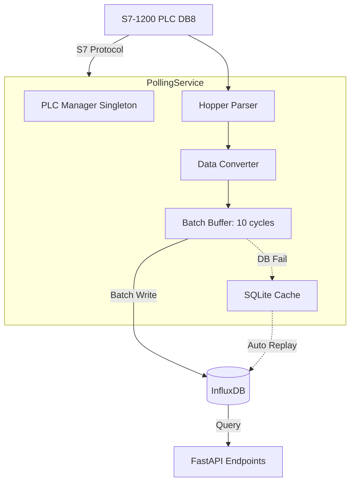

# Electric Furnace Hopper Backend - AI Coding Guidelines

> **Project Identity**: `ceramic-hopper-backend` (FastAPI + InfluxDB + S7-1200)  
> **Role**: AI Assistant for Industrial IoT Backend Development  
> **Core Philosophy**: **Occam's Razor** - Simplicity is stability. Keep logic minimal, stateless where possible.

---

## 1. 核心架构原则 (Core Principles)

### 1.1 配置驱动 (Configuration Driven)

- **config_hoppers_8.yaml**: 唯一设备配置文件，定义4类传感器的内存映射。
- **原则**: 新增传感器或调整参数时，**优先修改 YAML**，避免硬编码。

### 1.2 高可靠性轮询 (High Reliability Polling)

- **长连接**: `PLCManager` 单例维护 S7 连接，避免频繁握手。
- **批量写入**: 采集数据缓存 10 次后批量写入 InfluxDB（`batch_write_size: 10`），减少 I/O 压力。
- **本地降级**: InfluxDB 不可用时自动降级写入 SQLite (`LocalCache`)，恢复后自动回放。
- **Mock 模式**: 当 `MOCK_MODE=true` 或无法连接 PLC 时，自动切换到 Mock 数据生成。

### 1.3 数据简化 (Data Simplification)

**料仓项目仅支持 4 类传感器** (遵循奥卡姆剃刀原则):

1. **PM10 传感器** (粉尘浓度监测)
2. **温度传感器** (料仓温度)
3. **电表** (电压、电流、功率)
4. **振动传感器** (X/Y/Z 三轴振动幅值)

**删除所有不需要的设备**: 称重、流量、SCR、辊道窑等。

---

## 2. 数据流架构 (Data Flow Architecture)



---

## 3. 关键文件结构 (Project Structure)

```text
ceramic-hopper-backend/
├── main.py                           # FastAPI 入口 (Lifespan管理)
├── config.py                         # 全局配置 (Env加载)
├── configs/                          # [配置层]
│   ├── config_hoppers_8.yaml         # ★ 料仓配置 (4类传感器)
│   ├── db_mappings.yaml              # DB块映射表 (仅DB8)
│   ├── plc_modules.yaml              # 基础模块定义
│   └── status_hopper_3.yaml          # 状态映射 (DB3)
├── app/
│   ├── core/
│   │   ├── influxdb.py               # InfluxDB 读写封装
│   │   ├── local_cache.py            # SQLite 本地降级缓存
│   │   └── influx_migration.py       # 自动Schema迁移
│   ├── plc/                          # [PLC 层]
│   │   ├── plc_manager.py            # 连接管理器 (Reconnect)
│   │   ├── parser_hopper.py          # 料仓数据解析器
│   │   └── s7_client.py              # Snap7 客户端封装
│   ├── tools/                        # [转换层]
│   │   ├── converter_elec.py         # 电表数据精简 (14->8字段)
│   │   ├── converter_pm10.py         # PM10数据转换
│   │   ├── converter_temperature.py  # 温度数据转换
│   │   └── converter_vibration.py    # 振动数据转换
│   ├── services/                     # [服务层]
│   │   ├── polling_service.py        # 核心轮询逻辑
│   │   └── history_query_service.py  # 历史数据查询
│   └── routers/                      # [API 路由]
│       ├── hopper.py                 # 料仓接口 (实时+历史)
│       ├── health.py                 # 健康检查
│       └── status.py                 # 设备状态接口
└── docker-compose.yml                # 容器编排
```

---

## 4. 核心实现规范 (Implementation Specs)

### 4.1 数据解析与转换流程

**Parse (解析)** → **Convert (转换)** → **Batch Write (批量写入)**

1. **Parse (解析)**:
   - `HopperParser` 读取 `config_hoppers_8.yaml` 中的偏移量。
   - 将 PLC 原始 `bytes` 解析为 Python 字典 (Raw Values)。
   - **不进行单位转换**，只按 `Byte/Word/Real` 读取数值。

2. **Convert (转换)**:
   - `Converter` 类将 Raw Values 转换为物理量 (Physical Values)。
   - 例: `ElectrocityMeterConverter` 精简电表字段为 `Pt`, `Ua`, `Ia` 等 8 个核心字段。
   - 例: `VibrationConverter` 提取 X/Y/Z 三轴振动幅值。

3. **Batch Write (批量写入)**:
   - 缓存 10 次轮询数据后，批量写入 InfluxDB。
   - 失败时自动降级到 SQLite (`LocalCache`)，数据库恢复后自动重放。

### 4.2 轮询服务特性 (`polling_service.py`)

```python
# 核心配置
POLL_INTERVAL = 6  # seconds (6秒轮询一次)
BATCH_SIZE = 10    # 10次轮询后批量写入 (60秒一次写入)

# Mock 模式
# 当 MOCK_MODE=true 或 PLC 连接失败时，自动生成模拟数据
# 保障前端开发不依赖硬件
```

**异常处理规范**:

- 轮询循环必须包含宽泛的 `try-except`。
- 捕获所有已知/未知异常并记录日志。
- **绝不允许服务崩溃退出**。

### 4.3 InfluxDB 设计

**Measurement**: `sensor_data` (单表存储)

**Tags**:

- `device_id`: 设备编号 (例: `hopper_1`)
- `device_type`: 设备类型 (固定值: `hopper`)
- `module_type`: 模块类型 (例: `pm10`, `temperature`, `electricity`, `vibration`)

**Fields** (动态字段):

- PM10: `concentration` (μg/m³)
- Temperature: `temperature` (°C)
- Electricity: `Pt`, `Ua_0`, `Ua_1`, `Ua_2`, `Ia_0`, `Ia_1`, `Ia_2`, `PF` (功率因数)
- Vibration: `vibration_x`, `vibration_y`, `vibration_z` (mm/s)

---

## 5. API 接口规范

**Base URL**: `http://localhost:8082` (注意端口与其他项目区分)

### 5.1 实时数据接口

```yaml
GET /api/hopper/realtime:
  描述: 获取料仓所有传感器的实时数据
  返回:
    pm10:
      concentration: 35.5 # μg/m³
      status: 'normal'
    temperature:
      value: 28.5 # °C
    electricity:
      Pt: 5.8 # kW
      Ua_0: 380.0 # V (A相电压)
      Ia_0: 15.2 # A (A相电流)
    vibration:
      x: 0.5 # mm/s
      y: 0.3
      z: 0.4
```

### 5.2 历史数据接口

```yaml
GET /api/hopper/history:
  参数:
    - sensor_type: string (pm10|temperature|electricity|vibration)
    - start: ISO 8601 datetime
    - end: ISO 8601 datetime
    - interval: string (5s|1m|5m|1h|1d)
  返回: [{ timestamp: '2026-01-18T10:00:00Z', value: 35.5 }, ...]
```

### 5.3 健康检查接口

```yaml
GET /api/health:
  返回:
    status: 'healthy'
    influxdb_connected: true
    plc_connected: true
    queue_length: 8 # 批量写入队列长度
    last_poll_time: '2026-01-18T10:00:00Z'
```

---

## 6. 稳定性与性能优化 (Stability & Performance)

### 6.1 [CRITICAL] 防止服务崩溃

```python
# ✅ 正确做法: 轮询循环必须包含宽泛的异常捕获
async def polling_loop():
    while is_running():
        try:
            await poll_and_write()
            await asyncio.sleep(POLL_INTERVAL)
        except Exception as e:
            logger.error(f"Polling error: {e}", exc_info=True)
            await asyncio.sleep(POLL_INTERVAL)  # 继续运行，不退出
```

### 6.2 [CRITICAL] 防止批量写入阻塞 API

**问题**: 原磨料车间项目 `batch_write_size=30`，导致批量写入时 API 响应 2-5 秒延迟。

**解决方案**:

```python
# config.py
batch_write_size: int = 10  # 从30降到10，减少阻塞时间
```

### 6.3 [CRITICAL] InfluxDB 连接管理

```python
# ✅ 正确做法: 使用单例模式，复用连接
@lru_cache()
def get_influx_client():
    return InfluxDBClient(url=settings.influx_url, token=settings.influx_token)

# ✅ 应用关闭时释放资源
def close_influx_client():
    get_influx_client.cache_clear()
```

### 6.4 [CRITICAL] PLC 重连机制

```python
# PLCManager 必须实现自动重连
def reconnect(self):
    max_retries = 3
    for i in range(max_retries):
        try:
            self._client.connect()
            logger.info("PLC reconnected successfully")
            return True
        except Exception as e:
            logger.warning(f"Reconnect attempt {i+1} failed: {e}")
            time.sleep(2 ** i)  # 指数退避
    return False
```

---

## 7. 配置文件示例 (config_hoppers_8.yaml)

```yaml
# 料仓配置 (DB8) - 仅包含4类传感器
db_number: 8
hopper_count: 8 # 支持8个料仓

modules:
  - module_type: pm10
    base_module: PM10 # 引用 plc_modules.yaml
    offset: 0

  - module_type: temperature
    base_module: TEMPERATURE
    offset: 10

  - module_type: electricity
    base_module: ELECTRO_METER # 14字段电表
    offset: 20

  - module_type: vibration
    base_module: VIBRATION_3AXIS
    offset: 90
```

---

## 8. Mock 数据生成 (开发模式)

```python
# 当 MOCK_MODE=true 时，自动生成模拟数据
def generate_mock_data():
    return {
        "pm10": {"concentration": random.uniform(20, 50)},
        "temperature": {"value": random.uniform(25, 35)},
        "electricity": {
            "Pt": random.uniform(5, 10),
            "Ua_0": random.uniform(370, 390),
            "Ia_0": random.uniform(10, 20),
        },
        "vibration": {
            "x": random.uniform(0.3, 0.8),
            "y": random.uniform(0.2, 0.6),
            "z": random.uniform(0.3, 0.7),
        },
    }
```

---

## 9. 开发命令 (Development)

```powershell
# 启动 Mock 模式后端
cd ceramic-hopper-backend
docker compose --profile mock up -d --build

# 本地运行 (需要先启动 InfluxDB)
uvicorn main:create_app --factory --host 0.0.0.0 --port 8082 --reload

# 测试健康检查
curl http://localhost:8082/api/health
```

---

## 10. 代码审查清单 (Code Review Checklist)

- [ ] 所有轮询逻辑都有 `try-except` 保护
- [ ] `batch_write_size` 设置为 10 (不超过 20)
- [ ] InfluxDB 客户端使用 `@lru_cache()` 单例
- [ ] PLC 连接失败时有重连机制
- [ ] API 响应时间 < 200ms (批量写入不阻塞)
- [ ] 日志包含时间戳和 traceback
- [ ] 配置文件中没有硬编码 IP 地址
- [ ] Mock 模式可以独立运行

---

**AI 指令**:

1. **简单至上**: 能用简单逻辑实现的，不要引入复杂的类层次结构。
2. **防崩溃**: 任何涉及 I/O (网络, 数据库, PLC) 的操作必须有超时和重试机制。
3. **清晰日志**: 报错时产生的日志必须包含 traceback 和上下文信息。
4. **删除冗余**: 删除所有不需要的设备类型 (称重、流量、SCR、辊道窑)。
